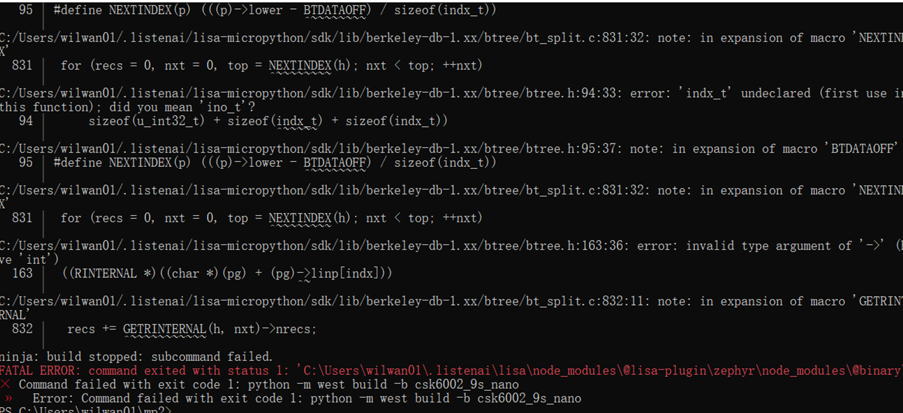
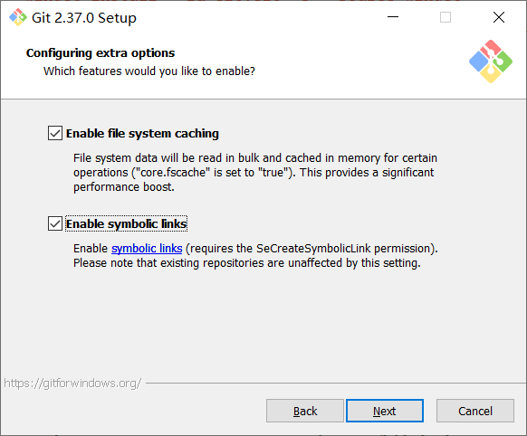

# 编译相关

## Windows 下报编译 `berkele-db-1.xx` 出错

在 `berkele-db-1.xx` 这一引用库中，有部分代码文件是通过软链接的形式创建的，而如果你在使用 `lisa mpy use-sdk` 命令的时候 Git 正确的创建成功，那么编译过程就会出错。

这是因为，在 Windows 中安装 Git 时，默认的安装流程没有勾选 **Enable symbolic links** 选项，这是让 Git 可以创建软连接文件必须开启的选项。可以尝试重新打开 Git 安装程序，到下图这一界面时，勾选对应选项进行安装。

