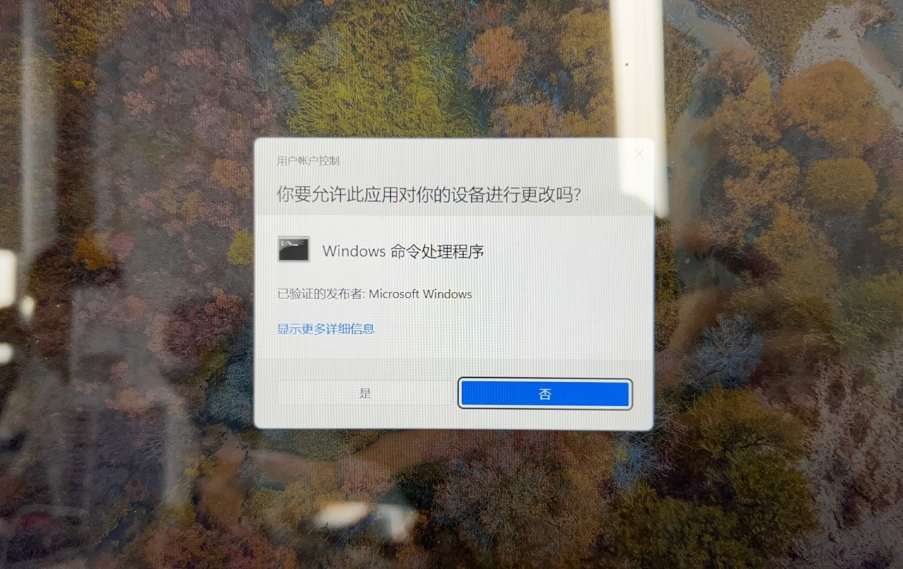

# 安装

## 获取 Lisa 并安装 Zephyr 开发环境

作为 Zephyr 应用的一种表现形式，进行 MicroPython 应用开发前同样需要安装完整的 Zephyr 相关工具。

请参考 [快速开始-安装开发环境](https://docs.listenai.com/chips/600X/quick_start/start_env) 进行对应配置，若已配置完成，则直接进入下一步。

## 安装 Lisa MicroPython 插件

在终端中执行如下命令：

```bash
lisa install @lisa-plugin/micropython -g
```

安装完成后可通过下述命令查看当前 MicroPython 插件的相关信息：

```bash
lisa info micropython
```

## 安装 MicroPython SDK

```bash
lisa mpy use-sdk
```

执行后，将会拉取 MicroPython SDK 相关源码。这些源码将会在编译 MicroPython 应用时被引用。

通过 `lisa info micropython` 命令，可看到打印出的 `MICROPY_SDK` 行将输出 SDK 的路径、版本等相关信息。

:::warning Windows 下的注意事项

特别地，当你使用的操作系统是 **Windows** 时，当你安装 Git 的时候需要注意勾选 **Enable symbolic links** 。

在 Windows 环境下，需要启用这一选项才能让 Git 在拉取代码的时候可以自动识别代码中的软链接文件。


请使用 **PowerShell** 来执行命令，避免使用 CMD (命令提示符) 做任何操作！

由于创建软链接文件要求用户授予管理员权限，所以当你运行命令后，会看到类似下图的界面，点击 【是】 即可。



:::

